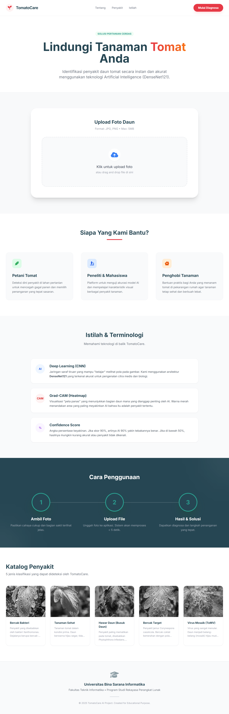
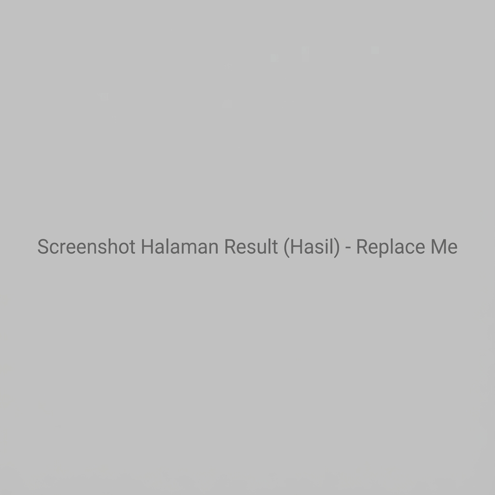
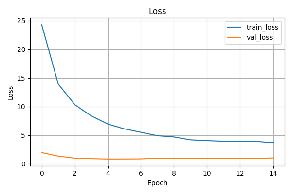
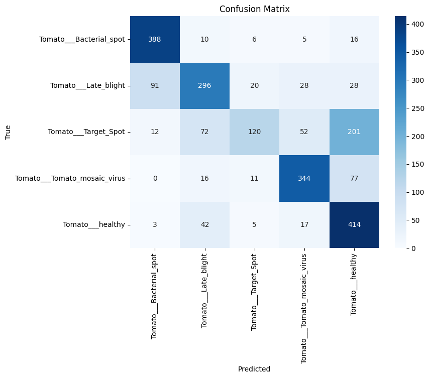

# 🍅 TomatoCare AI - Smart Disease Detection System


**TomatoCare** adalah sistem kecerdasan buatan (AI) berbasis web untuk mendeteksi penyakit pada tanaman tomat secara otomatis melalui foto daun. Dibangun menggunakan arsitektur **DenseNet121** dengan akurasi tinggi dan dilengkapi fitur validasi cerdas ("Satpam Digital") untuk mencegah input yang tidak valid.

---

## 📱 User Interface (Tampilan Aplikasi)

> **Catatan:** Screenshot tampilan aplikasi.

| Halaman Utama (Upload) | Halaman Hasil (Diagnosa) |
|:---:|:---:|
|  |  |
| *Form upload dengan validasi pintar* | *Hasil diagnosa + Heatmap AI* |


---

## ✨ Fitur Unggulan

### 1. 🧠 AI Diagnosis (DenseNet121)
Mampu mendeteksi 5 kondisi tanaman dengan presisi tinggi:
- **Tanaman Sehat (Healthy)**
- **Bercak Bakteri (Bacterial Spot)**
- **Hawar Daun (Late Blight)**
- **Bercak Target (Target Spot)**
- **Virus Mosaik (Mosaic Virus)**

### 2. 🛡️ Smart Image Validation ("Satpam Digital")
Sistem dilengkapi 6 lapis proteksi untuk menolak gambar "sampah":
- **Anti-Blur:** Menolak gambar yang buram/goyang.
- **Anti-Dark/Bright:** Menolak gambar terlalu gelap atau *overexposed*.
- **Anti-Foreign Object:** Menolak gambar coretan spidol, mobil, tembok, dll (Deteksi Warna).
- **Resolution Check:** Memastikan minimal resolusi 200x200 px.
- **Leaf Dominance:** Memastikan objek utama adalah daun (bukan buah tomat utuh).

### 3. 🔍 Explainability (Grad-CAM)
Transparansi AI! Sistem menampilkan **Heatmap** di atas gambar untuk menunjukkan bagian daun mana yang "dilihat" oleh AI sebagai indikasi penyakit.

---

## � Performa Model (Training Results)

Model dilatih menggunakan dataset yang telah melalui proses *Super Augmentation* dan penyeimbangan kelas (*Class Weighting 8.0x* untuk penyakit).

### Grafik Akurasi & Loss
| Akurasi Training vs Validasi | Loss Training vs Validasi |
|:---:|:---:|
|  |  |
| *Grafik menunjukkan peningkatan akurasi* | *Grafik penurunan error rate* |

### Matriks Evaluasi (Confusion Matrix)
Confusion Matrix menunjukkan detail performa prediksi per kelas. Diagonal utama yang gelap menandakan prediksi yang benar.



---

## 🛠️ Instalasi & Cara Menjalankan

Ikuti langkah ini untuk menjalankan proyek di komputer Anda secara lokal.

### Prasyarat
- Python 3.8 - 3.10
- Git

### 1. Clone Repository
Buka terminal dan jalankan perintah ini:
```bash
git clone https://github.com/ZaVoidd/TomatoCare-AI.git
cd TomatoCare-AI
```

### 2. Buat Virtual Environment (Opsional tapi Disarankan)
```bash
python -m venv venv
# Windows:
venv\Scripts\activate
# Mac/Linux:
source venv/bin/activate
```

### 3. Install Dependencies
Install pustaka yang dibutuhkan:
```bash
pip install -r requirements.txt
```

### 4. Jalankan Aplikasi
```bash
python app.py
```
Aplikasi akan berjalan di local server: http://127.0.0.1:5000/
Buka alamat tersebut di browser Anda.

---

## 📂 Struktur Project

```
├── data/               # [Di-ignore] Dataset gambar (Download terpisah)
├── assets/
│   └── images/         # Screenshot & Plot Grafik
├── models/
│   ├── densenet121_best.keras  # Model AI Utama (Pre-trained)
│   └── label_map.json          # Label kelas
├── src/
│   ├── train_improved.py       # Script Training (Colab)
│   ├── inference.py            # Script Prediksi
│   └── explain.py              # Script Grad-CAM
├── static/             # CSS, Images, Uploads
├── templates/          # Halaman HTML (Jinja2)
├── app.py              # Main Entry Point (Flask)
└── requirements.txt    # Daftar Pustaka
```

---

## 👨‍💻 Creator

**Created by Erza Aditia**

